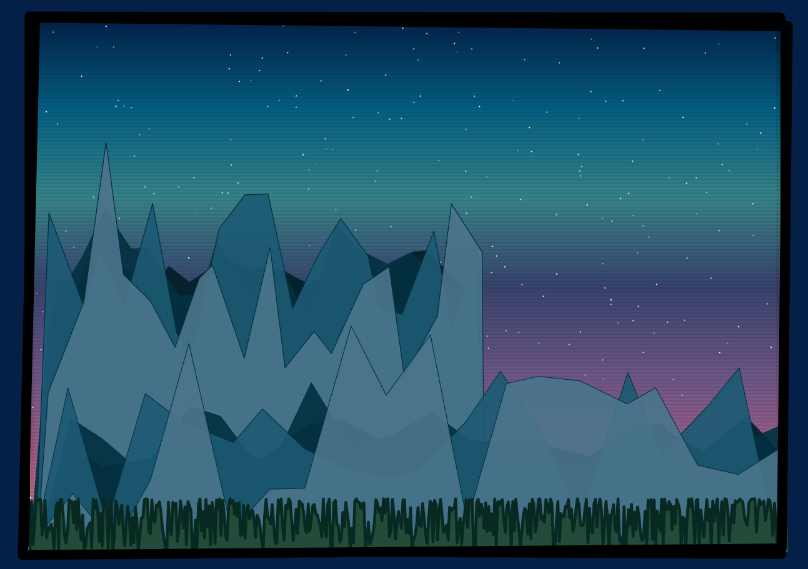

```{r setup, include=FALSE}
knitr::opts_chunk$set(echo = TRUE)
```

## About

***25 Days of Rtistry*** is a challenge I made for myself to practice making Rtistry from December 1st to December 25th. 
While a list of prompts were initially created at the beginning of the challenge, some creative liberties and deviations did occur.
If there is ever enough interest, I will create official prompts and share them publicly in the future.

I realize [Genuary](https://genuary.art) is in January, so some may not be interested in having an additional generative art challenge in December. We'll see where plans go, for now, here's my repository with all code featured. May it be a source of learning and/or inspiration for you.

## 2021 Pieces

### Day 1
**Prompt:** *Nature* <br>
**Code:** [Day1.R](Submissions/2021-12-01/Day 1.R)




