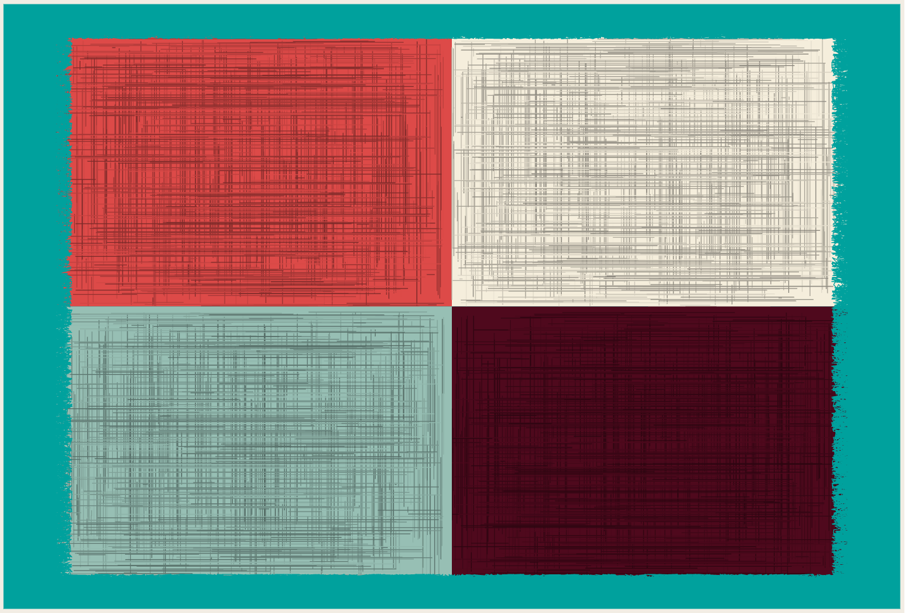
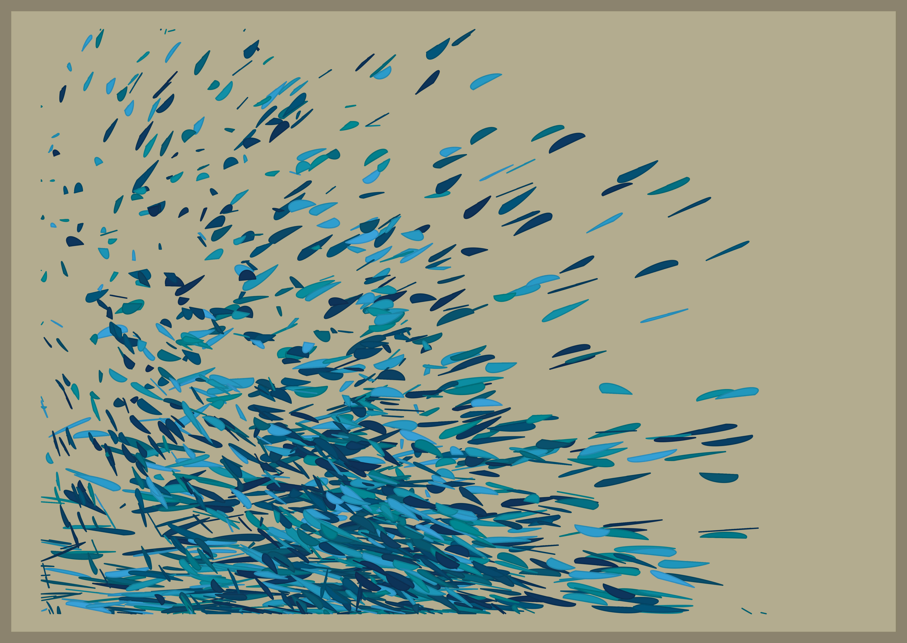

```{r setup, include=FALSE}
knitr::opts_chunk$set(echo = TRUE)
```

## About

***25 Days of Rtistry*** is a challenge I made for myself to practice making Rtistry from December 1st to December 25th. 
While a list of prompts were initially created at the beginning of the challenge, some creative liberties and deviations did occur.
If there is ever enough interest, I will create official prompts and share them publicly in the future.

I realize [Genuary](https://genuary.art) is in January, so some may not be interested in having an additional generative art challenge in December. We'll see where plans go, for now, here's my repository with all code featured. May it be a source of learning and/or inspiration for you.

## 2021 Pieces

### Day 1
**Prompt:** *Nature* <br>
**Code:** [Day 1.R](Submissions/2021-12-01/Day 1.R)

<p>

</p>

---

### Day 2
**Prompt:** *Science* <br>
**Code:** [Day 2.R](Submissions/2021-12-02/Day 2.R)

<p>

</p>

---

### Day 3
**Prompt:** *geom_segment()* <br>
**Code:** [Day 3.R](Submissions/2021-12-03/Day 3.R)

<p>

</p>

---

### Day 4
**Prompt:** *"BYOF" - Bring Your Own Functions* <br>
**Code:** [Day 4.R](Submissions/2021-12-04/Day 4.R)

<p>

</p>

---

### Day 5
**Prompt:** *geom_text()* <br>
**Code:** [Day 5.R](Submissions/2021-12-05/Day 5.R)

<p>

</p>

---

### Day 6
**Prompt:** *Revisit an Old Piece* <br>
**Code:** [Day 6.R](Submissions/2021-12-06/Day 6.R)

<p>

</p>

---

### Day 7
**Prompt:** *Monochrome* <br>
**Code:** [Day 7.R](Submissions/2021-12-07/Day 7.R)

<p>

</p>

---

### Day 8
**Prompt:** *geom_point()* <br>
**Code:** [Day 8.R](Submissions/2021-12-08/Day 8.R)

<p>

</p>

---

### Day 9
**Prompt:** *Iterations* <br>
**Code:** [Day 9.R](Submissions/2021-12-09/Day 9.R)

<p>

</p>

---

### Day 10
**Prompt:** *Rainbow* <br>
**Code:** [Day 10.R](Submissions/2021-12-10/Day 10.R)

<p>

</p>

---

### Day 11
**Prompt:** *geom_line()* <br>
**Code:** [Day 11.R](Submissions/2021-12-11/Day 11.R)

<p>

</p>

---

### Day 12
**Prompt:** *Circles* <br>
**Code:** [Day 12.R](Submissions/2021-12-12/Day 12.R)

<p>

</p>

---

### Day 13
**Prompt:** *Squares* <br>
**Code:** *Unavailable - Throwaway - Code wasn't saved* 🤦🏾

<p>

</p>

---

### Day 14
**Prompt:** *Borrow Some [TidyTuesday](https://github.com/rfordatascience/tidytuesday)  Data* <br>
**Code:** [Day 14.R](Submissions/2021-12-14/Day 14.R)

<center>
<p>

</p>

</center>

---

### Day 15
**Prompt:** *Make a Splash* <br>
**Code:** [Day 15.R](Submissions/2021-12-15/Day 15.R)

<p>

</p>

---

### Day 16
**Prompt:** *Air* <br>
**Code:** [Day 16.R](Submissions/2021-12-16/Day 16.R)

<p>

</p>

---

### Day 17
**Prompt:** *Bubbles* <br>
**Code:** [Day 17.R](Submissions/2021-12-17/Day 17.R)

<p>

</p>

---

### Day 18
**Prompt:** *Around the House* <br>
**Code:** *Unavailable - Throwaway - Code wasn't saved* 🤦🏾

<p>

</p>

---

### Day 19
**Prompt:** *No Color* <br>
**Code:** [Day 19.R](Submissions/2021-12-19/Day 19.R)

<p>

</p>

---

### Day 20
**Prompt:** *Texture* <br>
**Code:** [Day 20.R](Submissions/2021-12-20/Day 20.R)

<p>

</p>

---

### Day 21
**Prompt:** *3D* <br>
**Code:** [Day 21.R](Submissions/2021-12-21/Day 21.R)

<p>

</p>

---

### Day 22
**Prompt:** *Suprematism* <br>
**Code:** [Day 22.R](Submissions/2021-12-22/Day 22.R)

<p>

</p>

---

### Day 23
**Prompt:** *Trees* <br>
**Code:** [Day 23.R](Submissions/2021-12-23/Day 23.R)

<p>

</p>

---

### Day 24
**Prompt:** *Transformations* <br>
**Code:** [Day 24.R](Submissions/2021-12-24/Day 24.R)

<p>

</p>

---

### Day 25
**Prompt:** *Festive or Winter* <br>
**Code:** [Day 25.R](Submissions/2021-12-25/Day 25.R)

<p>

</p>