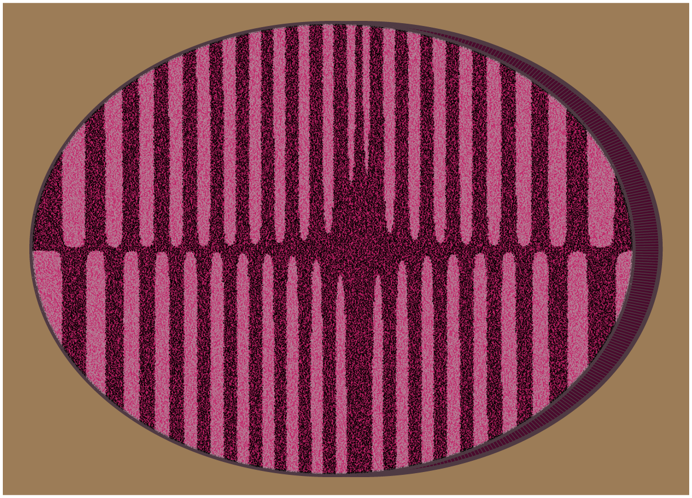
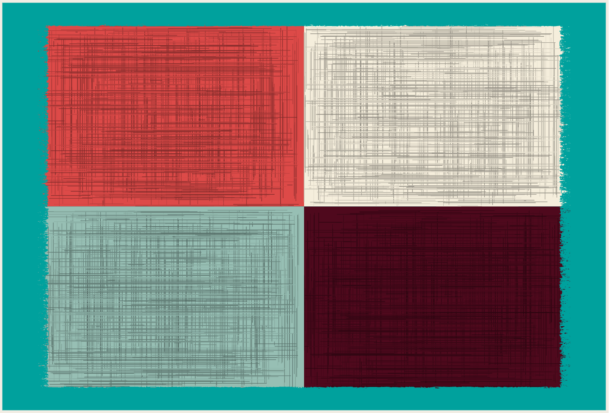
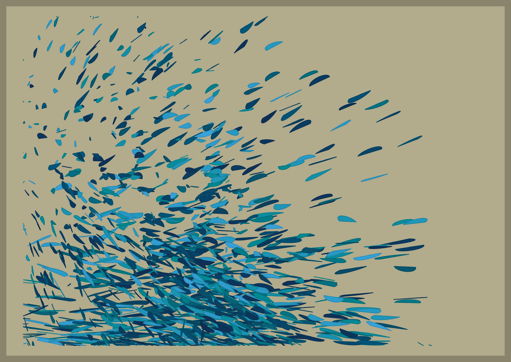

25 Days of Rtistry
================

## About

***25 Days of Rtistry*** is a challenge I made for myself to practice
making Rtistry from December 1st to December 25th. While a list of
prompts were initially created at the beginning of the challenge, some
creative liberties and deviations did occur. If there is ever enough
interest, I will create official prompts and share them publicly in the
future.

I realize [Genuary](https://genuary.art) is in January, so some may not
be interested in having an additional generative art challenge in
December. We’ll see where plans go, for now, here’s my repository with
all code featured. May it be a source of learning and/or inspiration for
you.

## 2021 Pieces

### Day 1

**Prompt:** *Nature*   **Code:** [Day
1.R](Submissions/2021-12-01/Day%201.R)

------------------------------------------------------------------------

### Day 2

**Prompt:** *Science*   **Code:** [Day
2.R](Submissions/2021-12-02/Day%202.R)

------------------------------------------------------------------------

### Day 3

**Prompt:** *geom\_segment()*   **Code:** [Day
3.R](Submissions/2021-12-03/Day%203.R)

------------------------------------------------------------------------

### Day 4

**Prompt:** *“BYOF” - Bring Your Own Functions*   **Code:** [Day
4.R](Submissions/2021-12-04/Day%204.R)

------------------------------------------------------------------------

### Day 5

**Prompt:** *geom\_text()*   **Code:** [Day
5.R](Submissions/2021-12-05/Day%205.R)

------------------------------------------------------------------------

### Day 6

**Prompt:** *Revisit an Old Piece*   **Code:** [Day
6.R](Submissions/2021-12-06/Day%206.R)

------------------------------------------------------------------------

### Day 7

**Prompt:** *Monochrome*   **Code:** [Day
7.R](Submissions/2021-12-07/Day%207.R)

------------------------------------------------------------------------

### Day 8

**Prompt:** *geom\_point()*   **Code:** [Day
8.R](Submissions/2021-12-08/Day%208.R)

## 

### Day 9

**Prompt:** *Iterations*   **Code:** [Day
9.R](Submissions/2021-12-09/Day%209.R)

------------------------------------------------------------------------

### Day 10

**Prompt:** *Rainbow*   **Code:** [Day
10.R](Submissions/2021-12-10/Day%2010.R)

------------------------------------------------------------------------

### Day 11

**Prompt:** *geom\_line()*   **Code:** [Day
11.R](Submissions/2021-12-11/Day%2011.R)

------------------------------------------------------------------------

### Day 12

**Prompt:** *Circles*   **Code:** [Day
12.R](Submissions/2021-12-12/Day%2012.R)

------------------------------------------------------------------------

### Day 13

**Prompt:** *Squares*   **Code:** *Unavailable - Throwaway - Code
wasn’t saved* 🤦🏾

\]

------------------------------------------------------------------------

### Day 14

**Prompt:** *Borrow Some
[TidyTuesday](https://github.com/rfordatascience/tidytuesday) Data*  
**Code:** [Day 14.R](Submissions/2021-12-14/Day%2014.R)

------------------------------------------------------------------------

### Day 15

**Prompt:** *Make a Splash*   **Code:** [Day
15.R](Submissions/2021-12-15/Day%2015.R)

------------------------------------------------------------------------

### Day 16

**Prompt:** *Air*   **Code:** [Day
16.R](Submissions/2021-12-16/Day%2016.R)

------------------------------------------------------------------------

### Day 17

**Prompt:** *Bubbles*   **Code:** [Day
17.R](Submissions/2021-12-17/Day%2017.R)

------------------------------------------------------------------------

### Day 18

**Prompt:** *Around the House*   **Code:** *Unavailable - Throwaway -
Code wasn’t saved* 🤦🏾 

------------------------------------------------------------------------

### Day 19

**Prompt:** *No Color*   **Code:** [Day
19.R](Submissions/2021-12-19/Day%2019.R)

------------------------------------------------------------------------

### Day 20

**Prompt:** *Texture*   **Code:** [Day
20.R](Submissions/2021-12-20/Day%2020.R)

------------------------------------------------------------------------

### Day 21

**Prompt:** *3D*   **Code:** [Day
21.R](Submissions/2021-12-21/Day%2021.R)

------------------------------------------------------------------------

### Day 22

**Prompt:** *Suprematism*   **Code:** [Day
22.R](Submissions/2021-12-22/Day%2022.R)

------------------------------------------------------------------------

### Day 23

**Prompt:** *Trees*   **Code:** [Day
23.R](Submissions/2021-12-23/Day%2023.R)

------------------------------------------------------------------------

### Day 24

**Prompt:** *Transformations*   **Code:** [Day
24.R](Submissions/2021-12-24/Day%2024.R)

------------------------------------------------------------------------

### Day 25

**Prompt:** *Festive or Winter*   **Code:** [Day
25.R](Submissions/2021-12-25/Day%2025.R)

